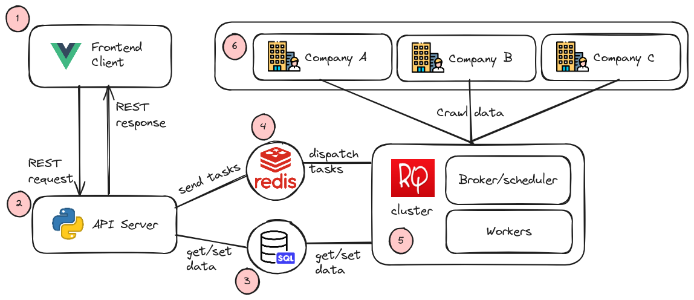

# Job Tracker

## Description

job tracker app collects job listings from many company websites and stores them in a database that can handle large amounts of data. It checks regularly for new jobs or ones that have been taken down, focusing on what users are interested in. Users can see all the job data collected or set up alerts based on specific keywords. They get email notifications whenever new jobs matching their interests appear, helping them stay updated and find relevant opportunities easily

## Live / Test

- Test link in Project Github header
- Or can just install and use docker
```
docker-compose up --build -d
```
- Access [http://localhost:5000](http://localhost:5000)

## Architecture



_Diagram created using [Excalidraw](https://excalidraw.com/#json=uK8JM14jXxv8O_MLhJcAi,CXKg7km3iIJtxBSRNw2n7g)_

1. Frontend/Client
- Written in Vue.js 3 + PrimeVue
- User can view all listing and search "keyword" without login
- When login, users are able to subscribe / create tracker for that "keyword" for a "duration" time window, and notify them via "email" if there is a new listing matched
- Communicate with (2) via REST API

2. Backend/API Server
- Written in Python3 + Flask
- Expose several REST API for job listing, tracker creation/viewing/deletion, notification, get stats, admin features
- Coordinate with RQ Cluster via Redis message queue, and persistent data storage (Relational database)

3. Database
- Persistent data storage
- Provide data for API Server and RQ Cluster
- Use Sqlite in development
- In production, can use any SQL db (postgres, mariadb, ...) with proper driver engine

4. Redis
- Message queue for sending (from backend) and dispatching (to RQ cluster) tasks
- Database for workers to coordinate when analyzing tasks results

5. RQ Cluster
- Written in Python + RQ
- A scheduler to run cronjob
+ Check expiration for trackers
+ Fetch new jobs (supports thousands) and analyzing new data
- Several workers to run crawling tasks (can scale horizontally)
- Expose a dashboard for monitoring

## System Requirements

On baremetal
- Backend:
    + Python / Flask / SQLAlchemy => with proper SQL driver engine
    + Redis
    + SQL service
- Frontend
    + Vue.js
    + Primevue

On docker
- `Dockerfile` inside each projects
- `docker-compose` to spawn a sample

## Project Requirements (from project rubric):

- Web application basic form, reporting ✅
    + View/search all listings
    + Create trackers

- Rest collaboration internal or API endpoint ✅
    + REST API between frontend and backend
    + Also use REST API to crawl data

- Data collection ✅
    + Workers crawl data from other companies site endpoints

- Data analyzer ✅
    + Combine listing
    + Analyze and notify new listing

- Data persistence any data store ✅
    + Use of relational database

- Unit tests ✅
- Integration tests ✅
- Using mock objects or any test doubles ✅
Use `pytest` to test single task, mock request testing, integration testing

- Product environment ✅
    + `.env` files and variables to separate development / testing and production

- Continuous integration ✅
    + Github action for running tests

- Production monitoring instrumenting ✅
    + rq dashboard to monitor cluster health

- Event collaboration messaging ✅
    + Redis message queue for communication between backend / rq cluster

- Continuous delivery ✅
    + Github action for build docker images
    + Ready to deploy